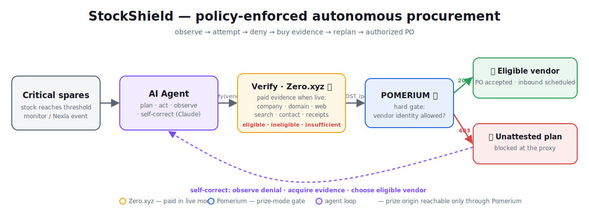

# Continuim

Autonomous emergency procurement for critical supplies. When a shortage threatens
operations, Continuim notices on its own, evaluates backup vendors, and prepares the
recovery PO at machine speed. That rescue loop is the product. Its trust layer requires
independent evidence and constrained authority before a PO can be committed.

> The rescue is the hero. The trust layer is the tool that makes it safe.
> An agent may be wrong, but it cannot be unauthorized.

Continuim watches a critical-supply pool, detects a shortage without a human pressing
“run,” evaluates candidate vendors, purchases current evidence through Zero.xyz, and requests
a purchase order through a Pomerium-protected route. Verification produces a vendor-scoped,
quote-scoped, payee-bound, amount-limited, expiring capability. The procurement origin
verifies that capability independently. Two disclosed scenario profiles, on-prem compute
spares and apparel dye, run through the same loop behind one dashboard selector.



## Why This Exists

When a datacenter has no replacement memory left, every minute of delay prolongs an
incident; when a production line runs out of one input, downtime is priced by the hour.
Human procurement — noticing the failure, hunting supplier lists, chasing quotes — is
exactly the latency an emergency cannot afford, so the fix has to be autonomous. But speed
is dangerous: the rushed emergency reorder is precisely how money gets wired to a lookalike
supplier. Emergency buying is useful only if speed does not let untrusted vendor input
become spending authority. The same model that reads that input should not be the final
authority on whether company spend is committed.

Continuim separates those responsibilities:

1. The local inventory monitor or Nexla FlexFlow emits the same versioned `stockout_risk`
   event when critical spares reach their threshold.
2. The agent ranks the disclosed synthetic candidates and attempts its lowest-cost plan.
3. Pomerium denies that plan because the agent has no vendor-scoped capability.
4. The agent observes the denial and buys independent evidence through Zero.
5. A deterministic policy returns `eligible`, `ineligible`, or `insufficient_evidence`.
6. Only an eligible result receives a signed capability bound to the vendor, domain, SKU,
   payee, quote, price, quantity, evidence hash, expiry, and one-time nonce.
7. The protected origin accepts the PO and records inbound stock as scheduled. It does not
   claim that goods have arrived or that supplier payment has settled.

The stage metric is **at-risk PO value prevented**, not “fraud dollars blocked.” The fixture
candidate is described as high-risk or ineligible, not proven fraudulent.

| Judging criterion | Visible proof |
|---|---|
| Idea | Critical infrastructure recovery under emergency buying pressure |
| Technical implementation | Signed object capability, payee/amount binding, replay defense |
| Tool use | Zero receipts and Pomerium authorize logs, with Nexla event ID as coverage |
| Presentation | Failure -> autonomous wake-up -> denial -> replan -> accepted PO |
| Autonomy | The monitor starts the loop; no manual action occurs after the threshold crossing |

## Start Developing

Requirements: Node.js 22.10+ and npm 10+.

```bash
git clone https://github.com/Ayush-sk-Pathak/loop-engineering-hackathon.git
cd loop-engineering-hackathon
npm run setup
npm run doctor
npm run dev
```

Open [http://localhost:3000](http://localhost:3000). The control plane listens on port
`4000`; the procurement origin listens on `127.0.0.1:4001` in local mode.

Click **Simulate node failure** three times. The monitor detects the threshold crossing and
starts the loop on its next check. The operator does not click a separate run control.

In another terminal:

```bash
npm run demo       # consume spares and print the monitor-started loop
npm run check      # typecheck + security/loop tests
npm run build      # check + production dashboard build
```

The default is intentionally deterministic:

- `VERIFICATION_MODE=fixture`: zero live charges and visibly labeled fixture evidence.
- `AUTH_MODE=development`: signed object binding at the origin, not a Pomerium prize proof.

Use `npm run doctor:prize` before recording. It fails until the live Zero service lock,
adapter, Pomerium route, authenticated denied identity, and verified-vendor identity are
configured.

## Docker

The local development topology can also run in containers:

```bash
npm run setup
docker compose up --build
```

This compose file deliberately uses the local authorization guard. Prize mode requires the
Pomerium route described in [docs/integrations/POMERIUM.md](docs/integrations/POMERIUM.md);
do not present a compose-generated origin `403` as Pomerium evidence.

## Implemented Boundaries

- Shared schema v1.1 contracts for stockout, evidence, attestation, PO, and decision events.
- Deterministic vendor-risk policy with missing-evidence and hard-failure outcomes.
- Signed attestation verification and complete PO object binding.
- Authorization before idempotency, request fingerprint checking, and nonce replay defense.
- Local SQLite state and decision trail.
- Always-on critical-inventory monitor plus deterministic node-failure input.
- Real Nexla-compatible webhook ingress at `POST /api/events/stockout`.
- HTTP adapter seam for live paid Zero evidence; paid signals without receipt IDs are refused.
- Pomerium signed-assertion verification with vendor subject-to-path binding.
- One-screen responsive operations dashboard that distinguishes fixture/local/live modes.

## Live Proof Requirements

Sponsor names in the architecture are targets until their proof requirements are met:

| Integration | Required proof |
|---|---|
| Zero.xyz | Exact pinned service IDs, quoted prices, wallet delta, and receipt ID from one settled call per service |
| Pomerium | `403` request ID plus `authorize` log with `allow:false`; rejected request absent from origin logs |
| Nexla | Nexla event ID transformed into schema v1.1 and delivered to `/api/events/stockout` |
| StableEmail | Zero receipt plus returned email message ID and received message |
| Akash | Public deployment URL and active lease; hosting is not part of the critical demo path |

The service catalog lock begins at [config/zero-services.json](config/zero-services.json).
It must not be marked verified from a marketing page alone.

## Repository Map

```text
apps/dashboard/          Next.js operations surface
packages/contracts/      authoritative seam definitions
packages/security/       attestation signing, verification, and request binding
services/agent/          bounded observe/act/replan loop
services/control-plane/  inventory monitor, orchestration, Nexla ingress, SQLite state
services/procurement/    protected PO origin and replay controls
services/verification/   evidence adapters and deterministic policy
config/                  safe environment template and Zero service lock
docs/integrations/       Zero, Pomerium, Nexla, and Akash runbooks
```

## Team Workflow

The four owners can work independently after `npm run setup` because the contracts are
already frozen. Ownership, branch steps, and integration rules are in
[CONTRIBUTING.md](CONTRIBUTING.md). The current sprint state is in
[docs/PROJECT_STATUS.md](docs/PROJECT_STATUS.md); the exact recording sequence is in
[docs/DEMO.md](docs/DEMO.md).

## Current Limits

The repository includes fixture evidence and adapter seams, not completed live Zero,
StableEmail, external Nexla FlexFlow configuration, or Akash deployment. Pomerium verification
code exists, but the live route and service accounts must be configured externally. Claude
Agent SDK integration is also pending; the current loop is a deterministic port-driven core
that keeps authorization outside model output.
