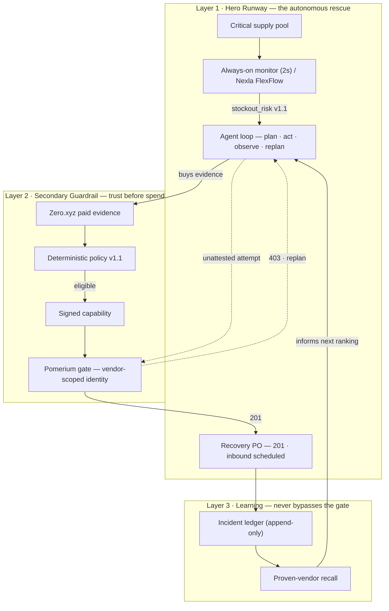
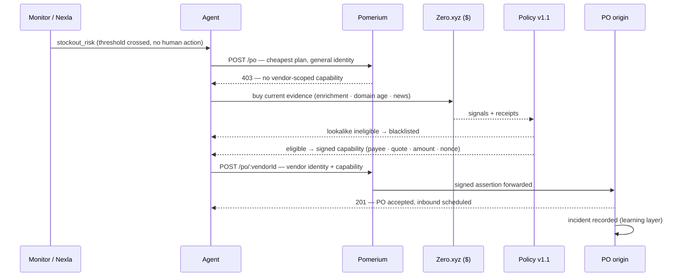

# Continuim Architecture

> Blueprint of record. This file is protected by the pre-commit hook. Product rationale and
> demo timing live in `docs/PRD.md`; implementation contracts live in
> `packages/contracts/src/index.ts`.

## Thesis

Continuim is a procurement control plane for critical-infrastructure stockout emergencies.
An autonomous monitor wakes the agent when the spares pool crosses its threshold. The agent
may source and evaluate suppliers, but it cannot commit a purchase order until paid evidence
has produced a vendor-scoped, quote-scoped, amount-limited, expiring capability.

The LLM is a planner and explainer, never the authorization boundary. Zero purchases current
evidence. A deterministic policy evaluates it. Pomerium authenticates the resulting machine
identity at the network boundary. The procurement origin verifies Pomerium's signed assertion
and binds its subject to the vendor in the URL. SQLite records decisions and replay keys.

## Trust Boundaries

1. **Inventory event boundary.** The in-process monitor and Nexla FlexFlow emit the same
   versioned `stockout_risk` contract. `source` makes the active path explicit; a local
   monitor event is never presented as Nexla proof.
2. **Evidence boundary.** Every signal names its provider, service ID, mode, cost, timestamp,
   and receipt. A fixture signal is visibly labeled and cannot be represented as live Zero.
3. **Decision boundary.** `vendor-risk-v1` is deterministic. Claude may summarize reasons,
   but it cannot turn an ineligible result into an attestation.
4. **Capability boundary.** An attestation binds vendor, quote, evidence hash, maximum amount,
   currency, nonce, policy version, and expiry. It contains no service-account secret.
5. **Pomerium boundary.** A verified demo vendor maps to a vendor-scoped Pomerium service
   account. The verification service releases only the corresponding credential reference.
   Rejected vendors receive no capability.
6. **Origin boundary.** `POST /po/:vendorId` verifies `X-Pomerium-Jwt-Assertion`, including
   signature, issuer, audience, expiry, and `sub == vendor:<vendorId>`. In both modes it also
   verifies Continuim's signed attestation and binds vendor, domain, SKU, payee, account
   reference, quote, unit price, quantity, amount, evidence, expiry, and nonce. Authorization
   happens before idempotency lookup. The origin is not publicly reachable in prize mode.

Pomerium does not inspect arbitrary JSON bodies or read our SQLite database. A single shared
agent identity is insufficient because both vendor choices would look identical to the proxy.

## Components And Ownership

| Owner | Paths | Deliverable |
|---|---|---|
| 1. Agent Core | `services/agent`, `services/control-plane` | Bounded plan/act/observe/recover loop; Claude planner adapter; event trace |
| 2. Zero Verification | `services/verification`, `config/zero-services.json` when pinned | Live paid evidence adapters, receipts, deterministic verdict, attestation |
| 3. Policy + Procurement | `services/procurement`, `infra/pomerium`, `deploy/akash` | Pomerium service identities and logs, private PO origin, StableEmail adapter, deployment |
| 4. Data + Experience | `apps/dashboard`, `infra/nexla`, `docs/DEMO.md` | Nexla flow, one-screen operations UI, planted vendor inputs, recording |

The local control plane is integration scaffolding, not a fifth owner. Each owner replaces a
port without changing the contracts.

## Three Layers




## Runtime Flow



```text
critical spare consumed by a node failure
  -> local monitor detects the threshold crossing
     (prize coverage: Nexla FlexFlow transforms the inventory event)
  -> stockout_risk event
  -> agent ranks two disclosed synthetic candidates
  -> cheapest plan attempts PO with authenticated general-agent identity
  -> Pomerium 403; origin is not reached
  -> agent observes the control and replans
  -> verification buys independent evidence through Zero
  -> deterministic policy
       ineligible -> blacklist -> continue
       eligible   -> signed attestation -> release vendor-scoped credential
  -> POST /po/:vendorId through Pomerium
  -> origin verifies Pomerium assertion + object bindings + nonce
  -> PO accepted -> StableEmail receipt -> inbound stock scheduled
  -> dashboard shows evidence spend, denial proof, PO ID, and decision events
```

The denied request occurs before evidence is acquired. The agent learns the environment's
authorization requirement from the real response and changes its plan. It is not forced to
order from a candidate after already classifying that candidate as ineligible.

## Frozen Seams

The TypeScript definitions are authoritative. Summary:

1. `StockoutRiskEvent`: schema version, event ID, SKU, current quantity, threshold,
   requested quantity, source, and timestamp.
2. `VerificationVerdict`: `eligible | ineligible | insufficient_evidence`, risk score,
   reasons, evidence signals, evidence mode, cost, evidence hash, policy version, and expiry.
3. `VendorAttestation`: vendor/domain, SKU, payee/account reference, quote/unit price,
   quantity/amount ceilings, evidence, currency, nonce, policy, expiry, and signature.
4. `POST /po/:vendorId`: `PurchaseOrderRequest` plus a vendor-scoped credential; returns
   `201 | 403`. Accepted orders schedule inbound stock; they do not claim physical refill.
5. `DecisionEvent`: correlation ID, phase, vendor, detail, timestamp, and safe metadata.

## Local Mode Versus Prize Mode

| Property | Local development | Prize demo |
|---|---|---|
| Evidence | Disclosed `.example` fixtures, `$0` | Pinned live Zero services and receipts |
| Trigger | Always-on local monitor | Nexla webhook -> FlexFlow -> agent webhook |
| Authorization | Signed attestation at origin | Pomerium service account + PPL + signed attestation at origin |
| Email | Recorded/queued | StableEmail paid through Zero |
| Hosting | Local npm processes | Akash if the core is already green |

The dashboard always displays the active evidence mode. Fixture mode is never acceptable in
the submitted Zero demo.

## Security Invariants

- No capability, no PO. Missing credentials must be denied.
- A credential for vendor A cannot authorize vendor B.
- A capability cannot exceed its quote, amount, currency, evidence hash, or expiry.
- An authenticated identity cannot change the payee, account reference, SKU, or unit price.
- Authorization is re-evaluated before idempotent replay and a nonce cannot create two POs.
- A rejected or insufficient-evidence vendor never receives a capability.
- The Pomerium route is the only network path to the production procurement origin.
- The stage denial must include a Pomerium request ID and authorize log; an origin-generated
  403 does not satisfy the Pomerium claim.
- Fixture evidence and fixture costs are labeled in code, state, UI, and documentation.
- A PO means `inbound_scheduled`; inventory increases only upon a later receipt event.
- The financial metric is `at-risk PO value prevented`, never `fraud dollars blocked`.
- Secrets remain environment-only and service-account tokens never enter decision events.

## Failure Strategy

Live integrations have explicit cut lines. If a Zero service is unavailable, use another
verified live Zero service and update the service lock. If Pomerium is not producing real
authorize logs, do not claim its prize integration. If Nexla or Akash stalls, keep the local
vertical slice and disclose the missing sponsor surface rather than simulating it.
